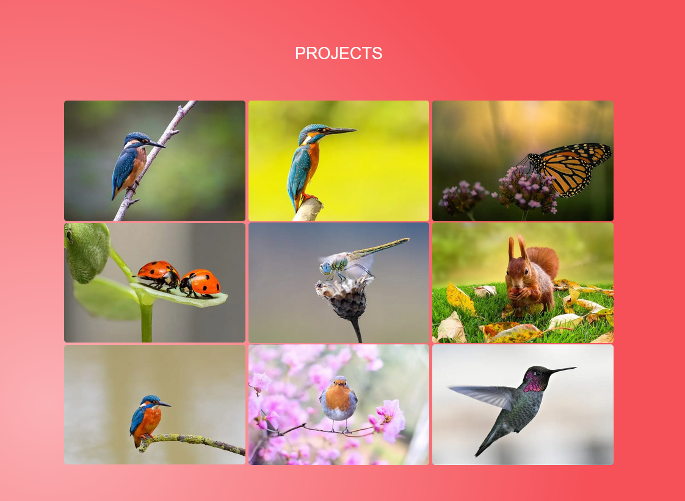

# Jane Doe Portfolio

Portfolio with animations.

## Folder Structure

<b>dist</b> folder is for usage. It contains files to avoid hastle during usage.

<b>src</b> folder contains separate files for source code and further tweaking.

## Screenshots

Home page with contact button.

About page with skills and experiences.

Project page with hover to individual project. Hover allows you to click on GitHub or on the website.

Contact page with footer.

See code <a href="https://github.com/veronikagregorec/jane-doe-portfolio/tree/main/src/scss">here</a>

[Back to the top](#jane-doe-portfolio)
